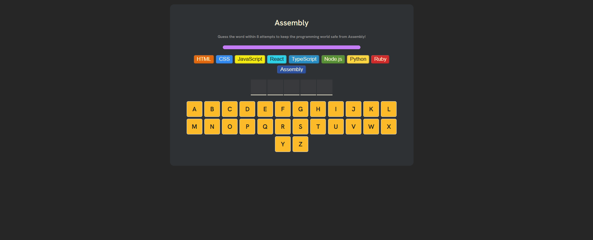
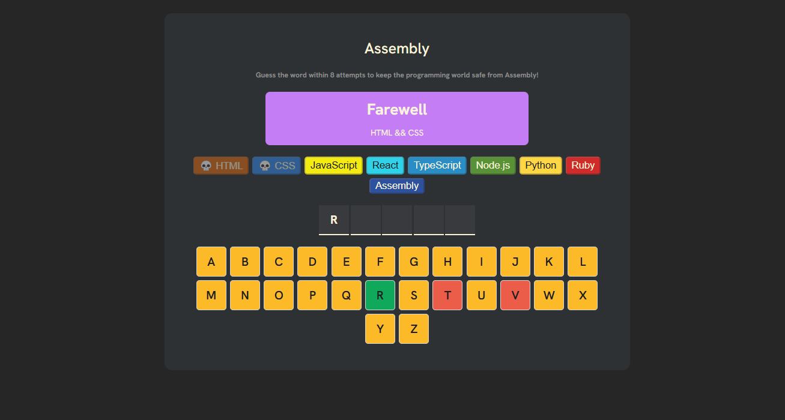
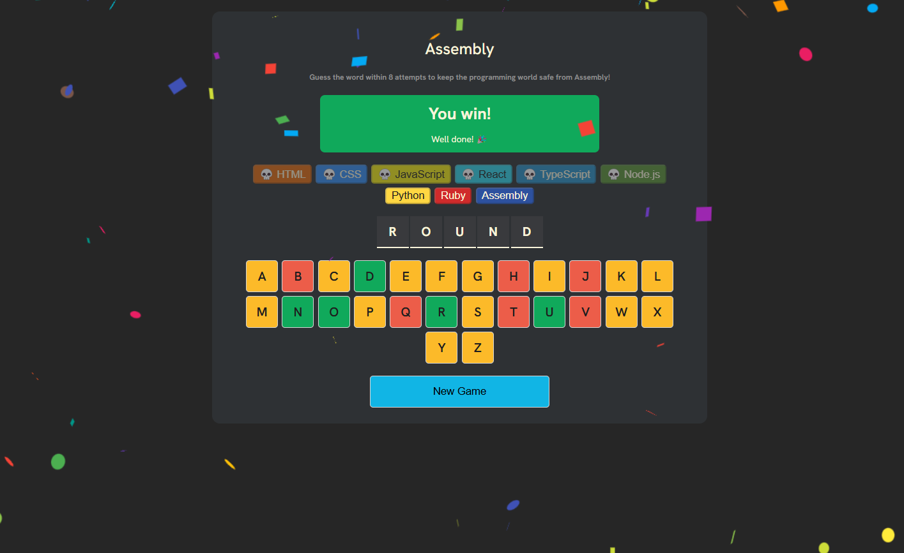
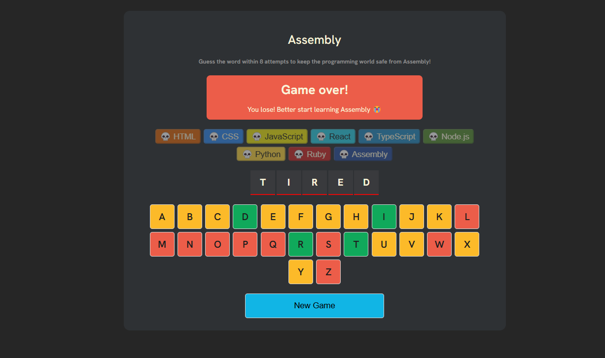

# Game Assembly in React

This project demonstrates how to create a game with React by handling user input, game state, and rendering in a functional, component-based way. 

## Features

* React-Based: Built entirely using React, showcasing state management, component structure, and hooks.
* Interactive Gameplay: Players can interact with the game through simple UI elements like buttons and keyboard inputs.
* Game State Management: Uses React’s useState and useEffect hooks for managing game progress, scores, and health.
* Mobile-Friendly: The game is responsive and can be played on both desktop and mobile devices.

## Illustration
1. Start page
   
2. Playing 
   
3. Winnig
   
4. Losing
   

## Gameplay
1. Start game page
2. The player presses a key (letter) on the keyboard.
    * If the letter is in the word:
         + The letter gets revealed in its correct position(s).
         + No change to the programming languages (lives).
    * If the letter is not in the word:
         + The player loses one of their programming languages (lives).
         + The word remains the same, with no letters revealed for that guess.
     * The remaining programming languages (lives) is displayed on the screen.
3. Winning the Game: 
    * If the player correctly guesses all the letters in the word:
         + A confetti animation appears on the screen.
         + A "You Win!" message pops up, celebrating the player's victory.
         + The game ends with a success message.
4. Losing the Game:
    * If the player loses all of their programming languages (lives), the game locks the keyboard to prevent further input.
    * A "You Lose!" message appears.
    * The word that the player was trying to guess is revealed.
## Additional Notes:
    * The game __include a button__ to play again to start a new round with a different word that shows up after losing or winning the game.  
    * The player has visual cues (e.g., lives remaining, word progress) to help them understand how they are doing during the game.
 fc84079279198ad96b8ce9585ec6e7025f86ba3c
# mini_assembly

## Game Assembly in React is a simple interactive game built using React.js. It combines the flexibility of modern web development with the logic and structure of game design.

__React + Vite__

This template provides a minimal setup to get React working in Vite with HMR and some ESLint rules.
